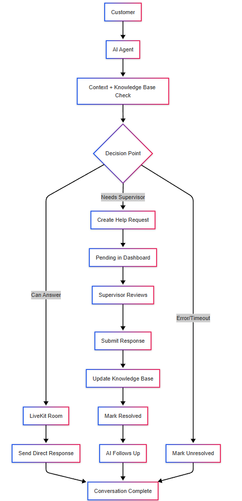

# AI Customer Service System



## System Flow

### 1. Customer Initiation
- Customer initiates call

### 2. AI Agent Processing
- Creates LiveKit room
- Checks salon information (Context)
- Queries knowledge base
- Either responds directly or escalates

### 3. Escalation Process
- Creates help request in Firestore
  - New entry in `help_requests` collection
- Appears in supervisor dashboard
- Sets request status as "pending"

### 4. Supervisor Dashboard
- Displays requests filtered by status
- Enables response submission
- Manages request status updates

### 5. Resolution Flow
- Updates knowledge base with new information
  - Add a new entry in `knowledge base` collection
- AI follows up with customer
- Marks request as resolved
- Updates conversation history

## DB Schema

### Help Requests Collection:
```json
{
  "help_requests": {
    "id": "string (auto)",
    "customerPhone": "string",
    "question": "string",
    "timestamp": "datetime",
    "status": "enum (pending|resolved|unresolved)",
    "responseText": "string|null",
    "respondedAt": "datetime|null",
    "followupSent": "boolean",
  }
}
```
### Knowledge Base Collection:
```json
{
  "knowledge_base": {
    "id": "string (auto)",
    "question": "string",
    "answer": "string",
    "createdAt": "datetime",
    "originatingRequestId": "string"
  }
}
```

## Setup Instructions

### Prerequisites
### 1. Clone the repository
### 2. Install Dependencies: 
   - frontend: `npm install`
   - backend: `pip install -r requirements.txt`
### 3. Login/Signup in Livekit:
   - Login here: https://cloud.livekit.io/login
   - Create a new project
   - Go to your LiveKit project’s API settings.
   - Create an API key if you don’t have one.
   - Copy both the key and secret.
### 4. TOGETHER_API_KEY:
   - Sign up or log in at together.ai.
   - Navigate to API Keys in your account settings.
   - Generate a new API key and copy it
### 5. Firebase:
   - Go to Firebase Console(https://console.firebase.google.com/)
   - Create a Firebase project
   - Project Settings > Service accounts > Generate new private key
   - Use that JSON file to set up Firebase Admin SDK

start the application
by running npm start on frontend
and python flask_backend_api.py on backend

run the python ai_agent.py to create/simulate call
```